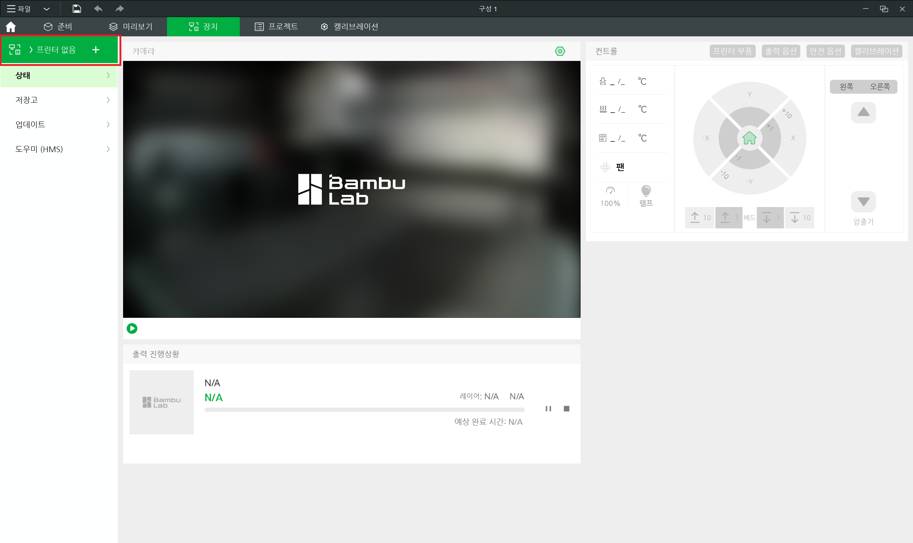
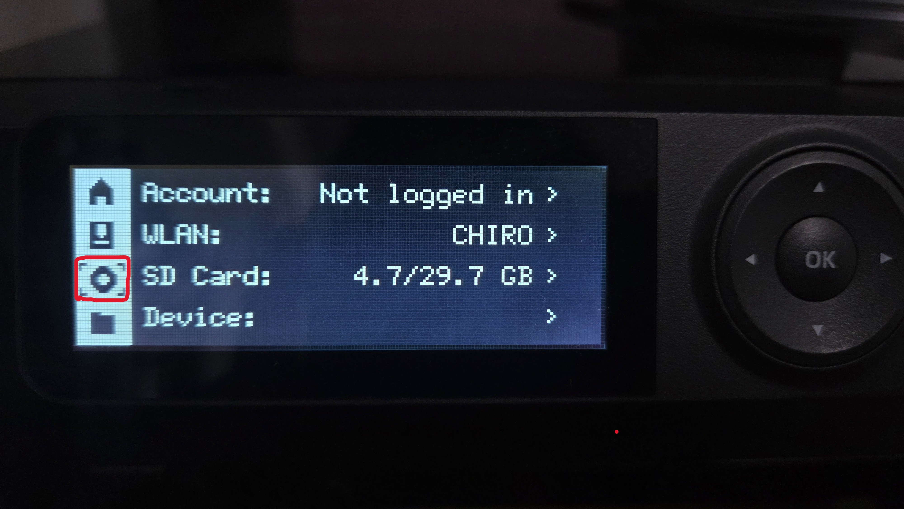
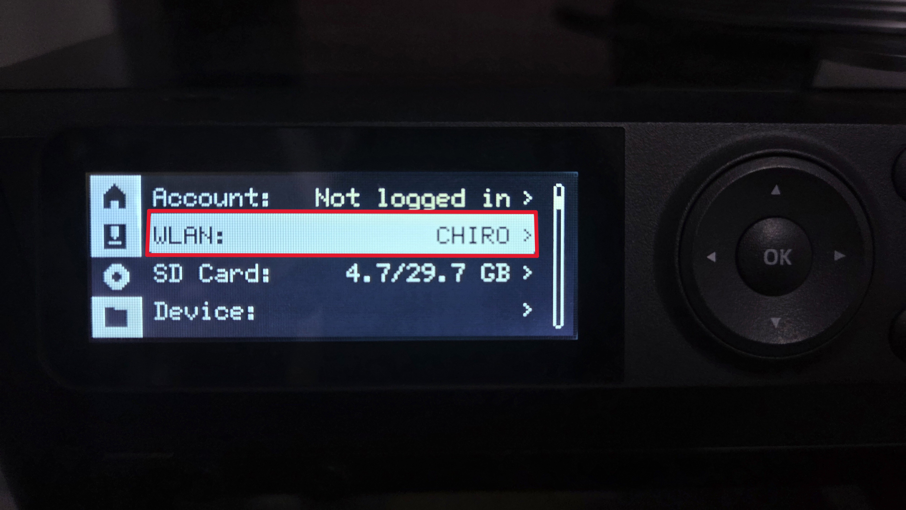
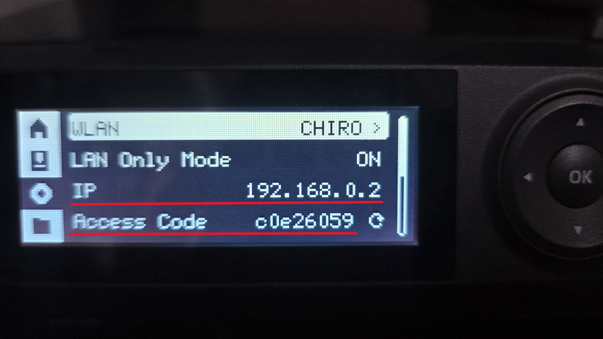
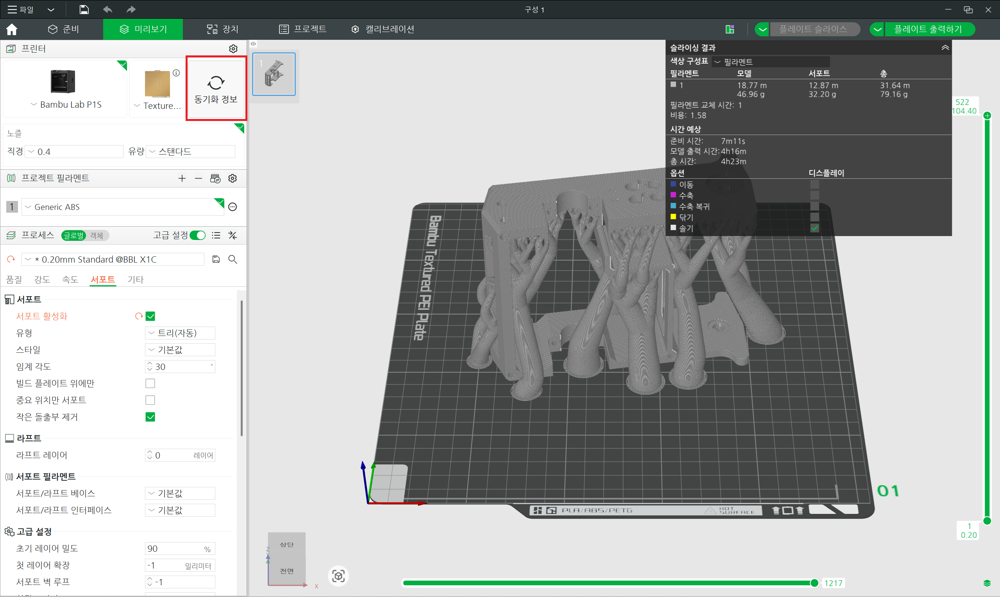
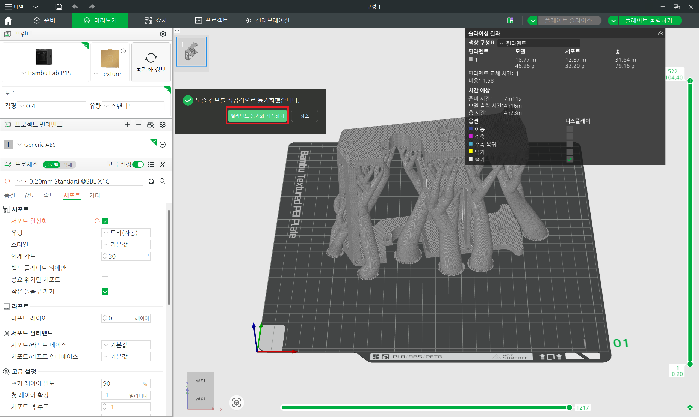
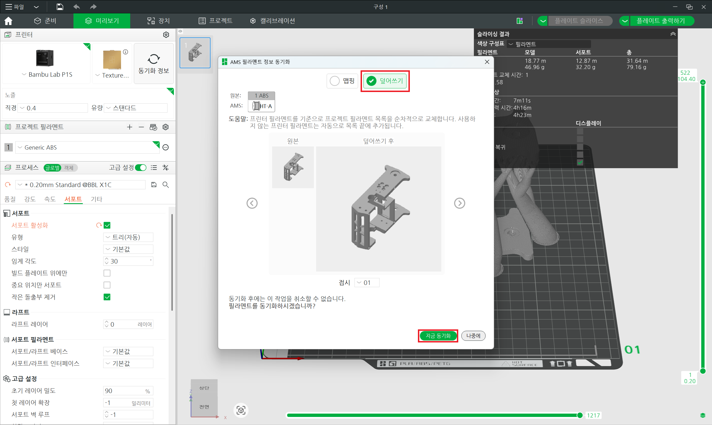
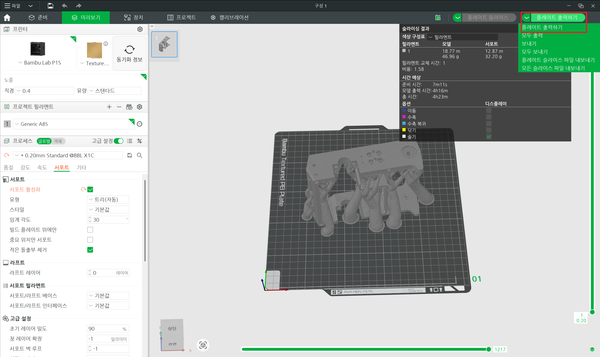
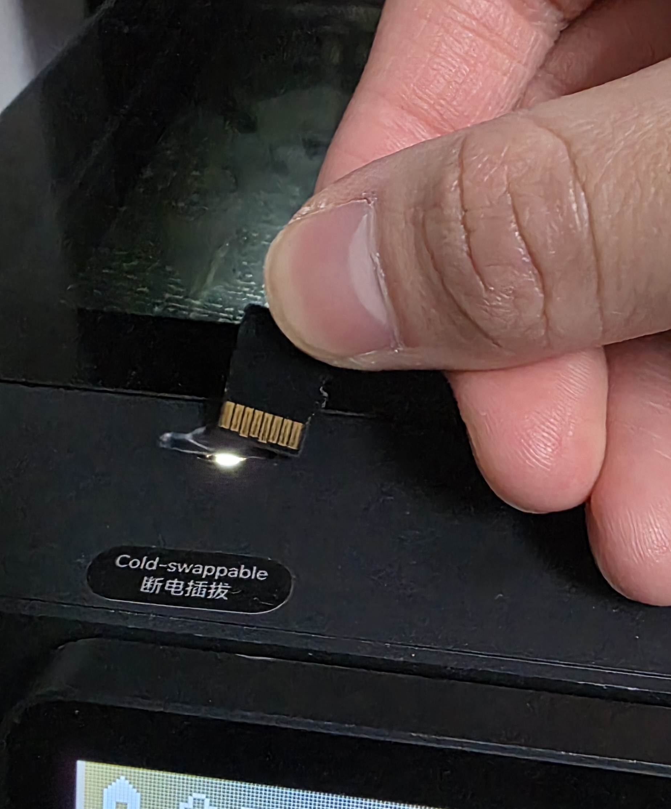
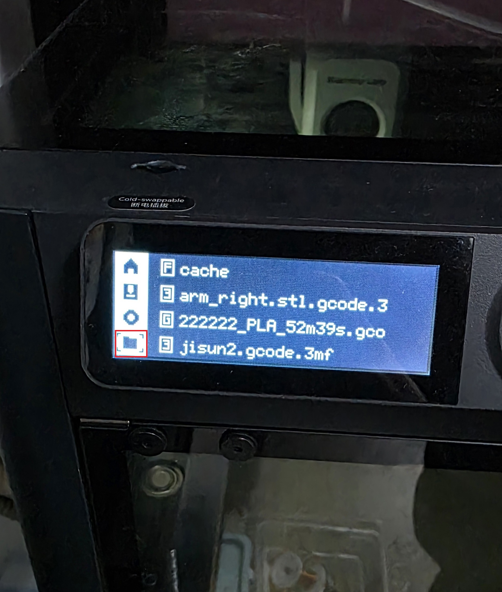

# 컴퓨터를 이용하는 방법
Bambu Studio를 이용하여 출력하기 위해서는 우선 노트북이 저희 동아리 와이파이를 연결해야합니다.
* 와이파이 이름: CHIRO
* 와이파이 비밀번호: chiro2001

와이파이 연결 후 위 Bambu Studio에서 장치 화면에 들어갑니다.

이후 액세스 코드 바인딩을 눌러서 동아리방 프린터와 연결하면 됩니다.

Bambu Lab P1S ip와 액서스 코드는 아래 사진을 따라 하시면 확인하실 수 있습니다.

프린터기의 ip는 항상 동일하나 액서스 코드는 바뀔 수 있으니 어느날 연결이 해제되면 위 방법으로 액서스 코드를 확인하여 다시 연결하면 됩니다.

프린터기와 연결한 이후 프린터를 동기화 해주어야합니다.

노즐 정보 동기화 이후 필라멘트 동기화도 진행해주시면 됩니다.

이후 플레이트 출력하기를 누르면 출력이 시작됩니다.

# SD카드를 이용하는 방법
SD카드를 이용하여 출력하기 위해서는 g코드 파일이 있어야합니다.

위 화면의 빨간 부분인 플레이트 슬라이스 파일 내보내기를 선택 후 클릭하면 g코드 파일이 컴퓨터에 저장됩니다.(이때 파일 이름에 한국어가 포함되어 있으면 이름이 깨집니다.)

이후 프린터기 위 쪽에 SD카드가 있고 눌러서 SD카드를 꺼낸 후 프린터기 위에 있는 usb에 SD카드를 꼽고 g코드 파일을 usb로 옮기면 됩니다.

그리고 SD카드를 다시 프린터기에 금색 부분이 위 사진 처럼 향하도록 다시 프린터기에 넣으면 됩니다.

프린터 화면에서 빨간색을 선택 후 프린트 하고자 하는 파일을 골라서 ok를 두번 누르면 출력이 시작됩니다.
