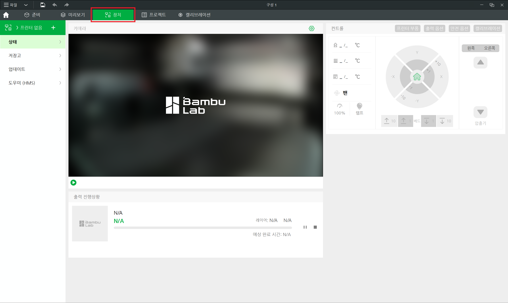

# 컴퓨터를 이용하는 방법
Bambu Studio를 이용하여 출력하기 위해서는 우선 노트북이 저희 동아리 와이파이를 연결해야합니다.
* 와이파이 이름: CHIRO
* 와이파이 비밀번호: chiro2001

와이파이 연결 후 위 Bambu Studio에서 장치 화면에 들어갑니다.

![프린터연결2]

이후 액세스 코드 바인딩을 눌러서 동아리방 프린터와 연결하면 됩니다.
* Bambu Lab P1S ip: 192.168.0.73

# SD카드를 이용하는 방법
