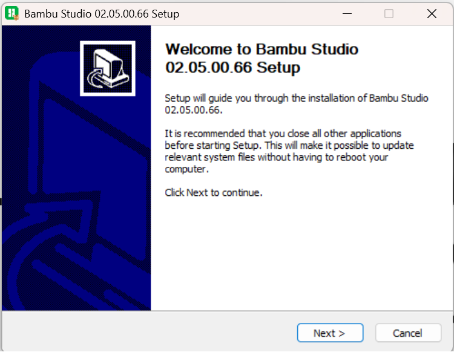
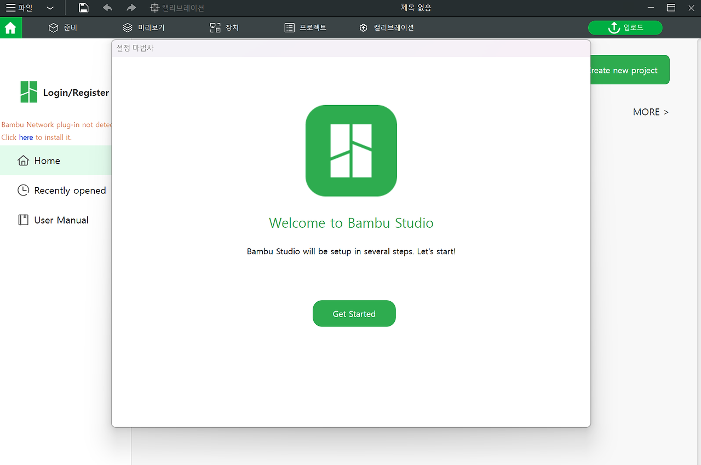
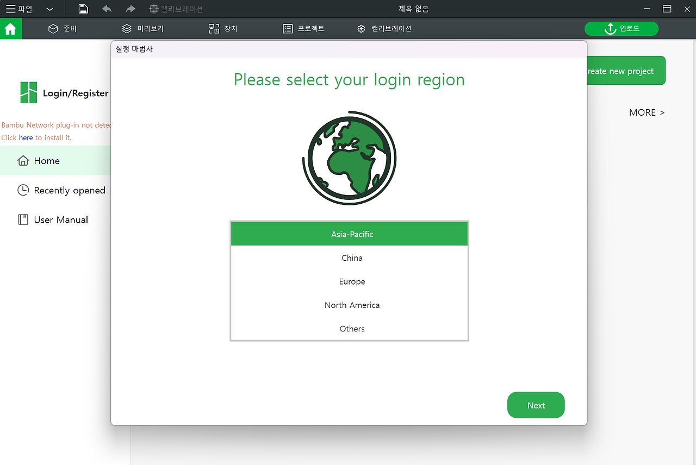
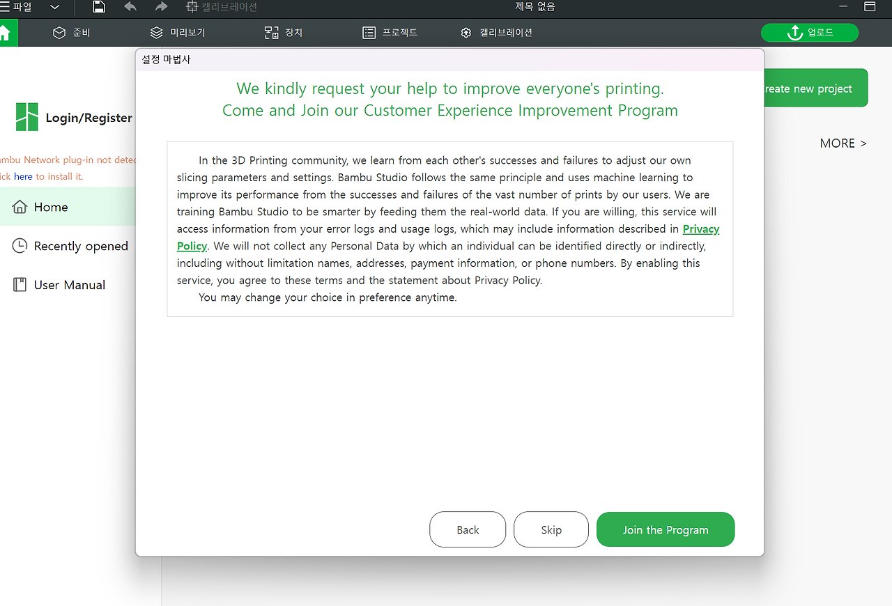
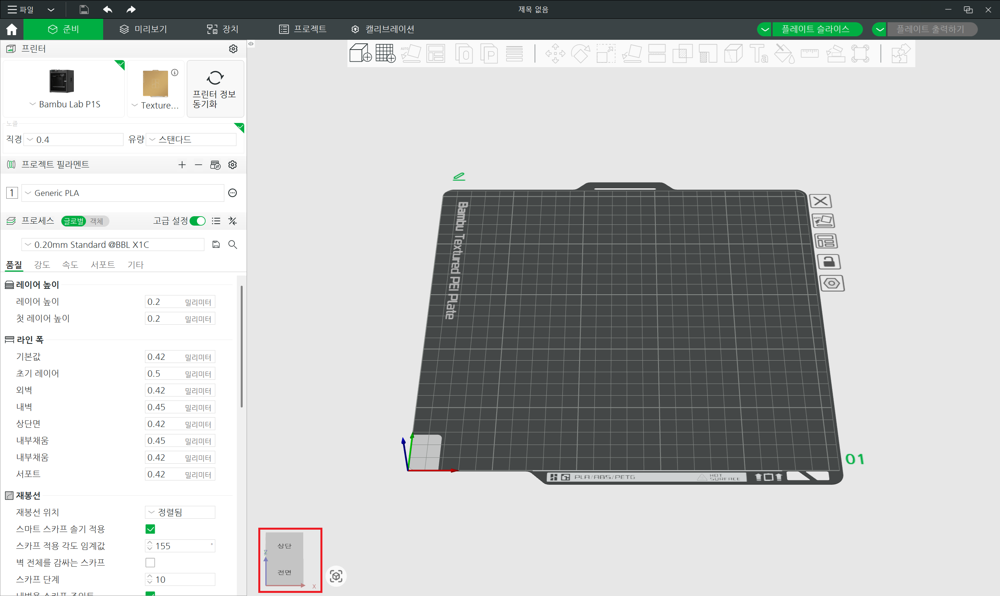
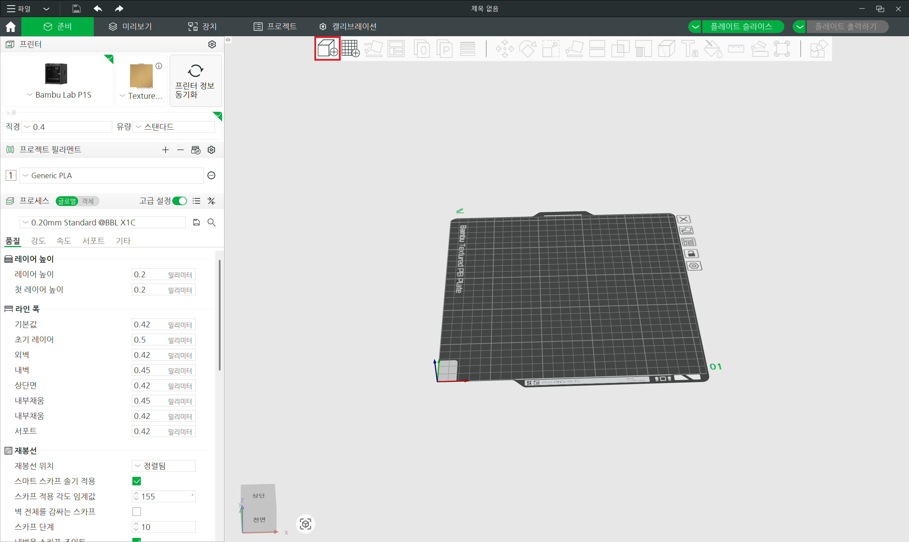
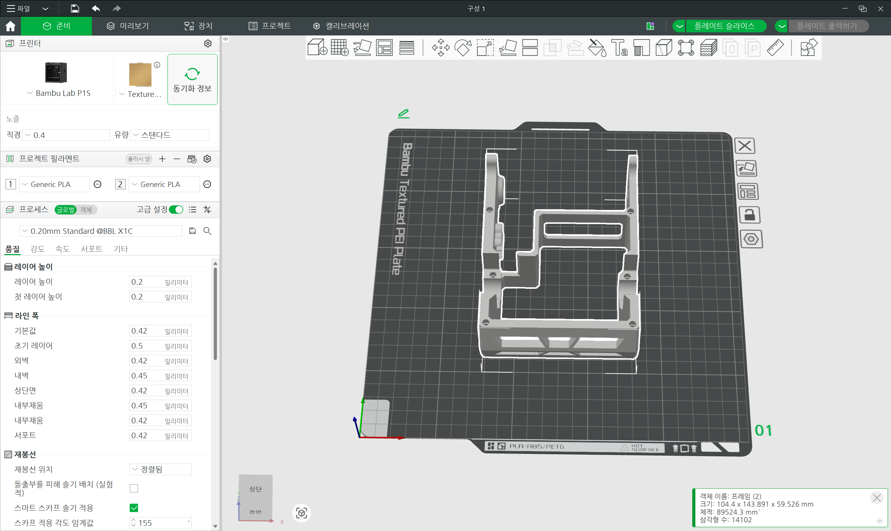
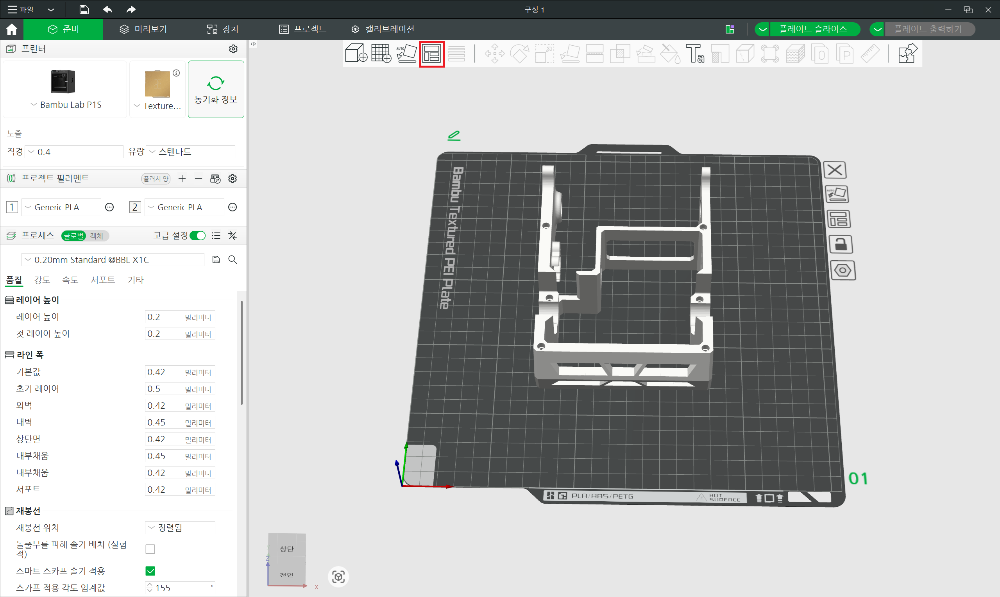
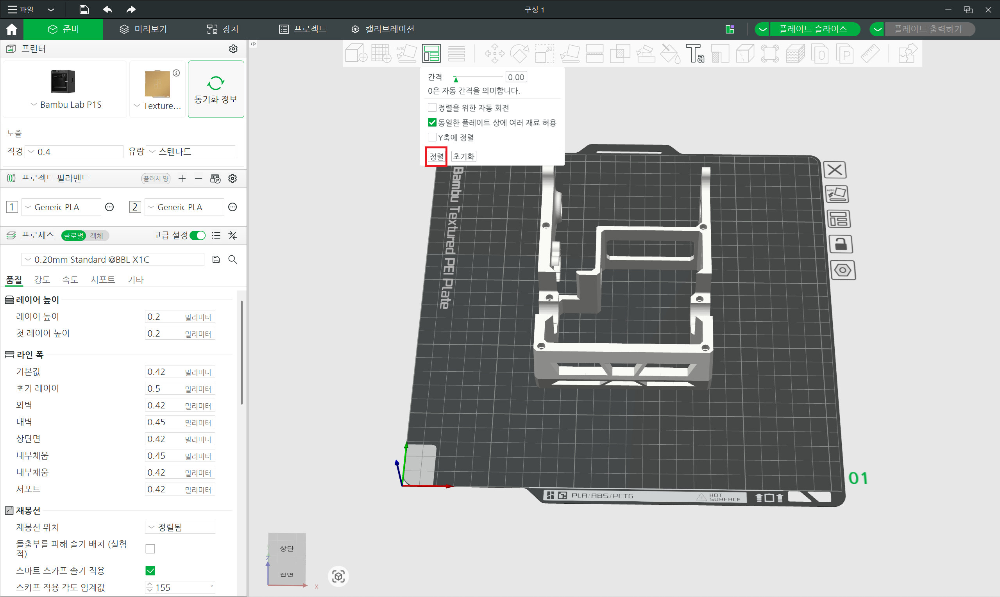

# Bambu Studio 설치법
https://bambulab.com/ko-kr/download/studio 이 사이트로 접속 후 Bambu Studio를 설치하면 됩니다.

파일 설치 후 파일을 열면 위 사진의 화면이 나올건데 next 누르고 I Agree 누르면 됩니다.

그 후 설치 위치를 정하고 Install을 눌러 설치하면 됩니다.

이후 위 사진과 같은 화면이 나오고 Get Started를 누르면 됩니다.

위 사진의 화면에서는 아시아를 선택하시면 됩니다.

그 다음은 이런 화면이 나오는데 스킵하셔도 됩니다.

이후 다 Next를 누르면 설치가 완료됩니다.
# Bambu Studio 사용법
### 화면 조작법

위 사진의 빨간색 부분을 이용하여 시점을 변경할 수 있으며 마우스 좌클릭을 누른 채로 마우스를 움직여서 시점을 변경할 수 있습니다.

마우스 휠을 이용하여 확대 및 축소를 할 수 있습니다.
### 파일 업로드

위 사진의 빨간색 부분을 클릭하여 원하는 파일을 불러올 수 있습니다. 3mf, stl, stp 등의 형식의 파일을 업로드할 수 있습니다. 
### 객체 조정

파일 업로드 이후 객체를 좌클릭 누른 채로 마우스를 움직여 객체의 위치를 이동시킬 수 있습니다.

위 사진의 빨간색 부분들을 클릭하면 객체들이 자동으로 정렬됩니다. 여러개의 객체들을 한 번에 출력할 때 사용하기 좋습니다.
