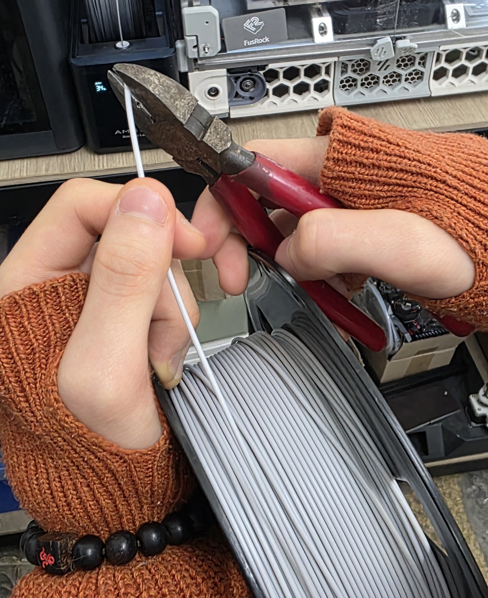
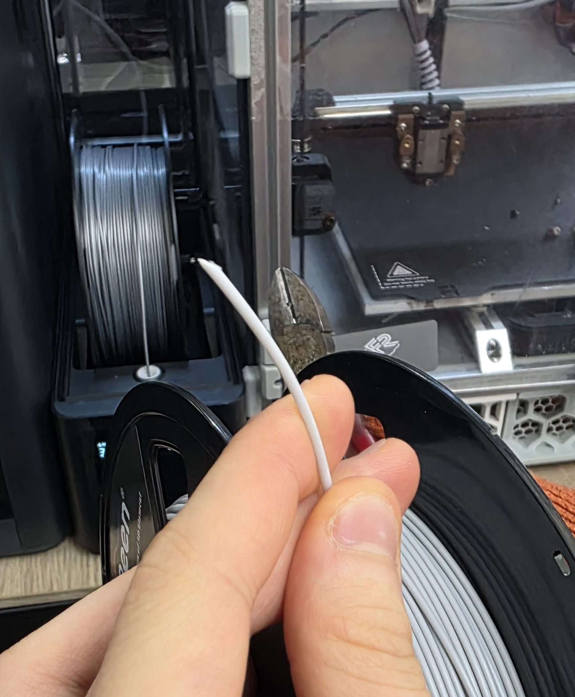
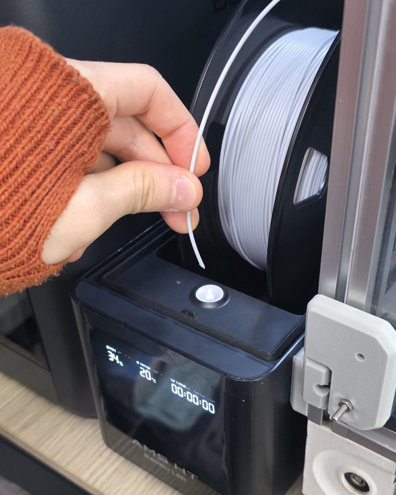
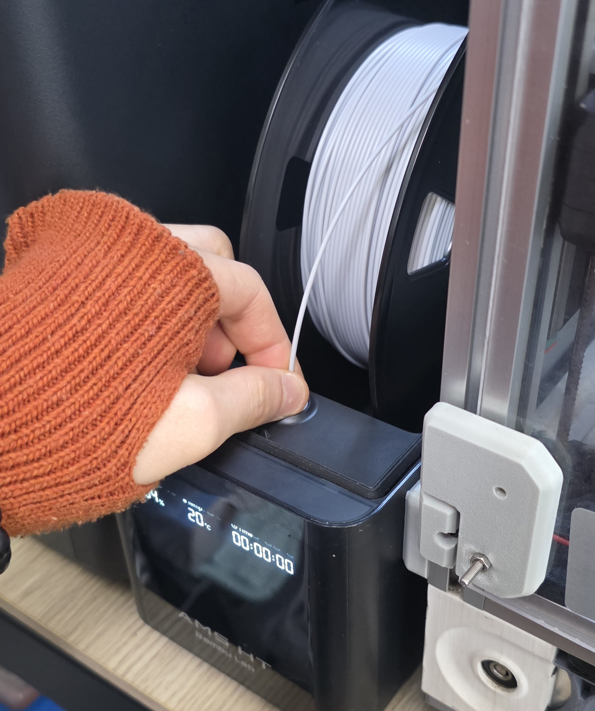

# 필라멘트 교체 방법
### ⚠️ 출력 도중 필라멘트를 다 써서 출력이 멈춘 경우엔 가능하면 운영진에게 우선 연락을 하고 필라멘트 교체를 진행해주세요.

우선 새 PLA 필라멘트를 꺼낸 후 필라멘트의 끝 부분을 아래 사진처럼 뾰족하게 잘라주시면 됩니다.

이후 필라멘트를 끼워 넣으면 됩니다.

이후 프린팅을 다시 시작하면 됩니다.

### ⚠️ PLA 소재가 아닌 ABS 소재를 사용하실 경우 기술부에 승인 후 사용해주세요
ABS 소재를 사용하여 출력시 발암물질이 발생하여 기술부에게 승인을 받고 사용해주세요
